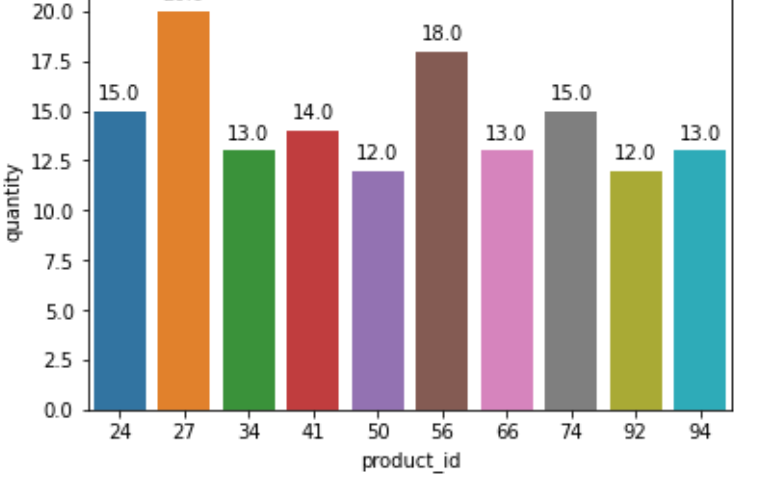

# Store-directories-and-filenames-as-df
## 1) Задача
Собрать все данные из папки **data** в один датафрэйм и выполнить необходимые операции c данными

Данные имеют следующую структуру:
- записываются для каждого пользователя, совершившего покупки, каждый день
- для каждой даты есть своя папка, внутри неё – папки для каждого пользователя
- внутри каждой папки есть файл data.csv, где и хранятся данные
Схематично выглядит так:

    

## 2) Стек
   - Python
       - pandas
       - seaborn
       - matplotlib.pyplot
       - OS Module

Specific functions:
- os.walk() store directories and filenames as df
- os.getcwd() to get the current working directory in Python
- drop_duplicates( ) and duplicated()
- merging data from 2 files merge()
- sns.barplot()

## 3) Этапы
Просмотр папок и пр. операции, связанные с файлами и папками, выполняются с помощью библиотеки os. При вложенности папок и необходимости добраться до дна можно использовать os.walk
Создаём список путей до ниднего уровня, отбирая соответствующие директории по длине пути
Из директорий, найденныех ранее при помощи os.walk извлекаем содержимое csv файла
Добавляем в df х столбец, где название директории бьём на названия папок отделенных '/' и добавляем поле с именем
Складываем в один df все выгружаемые циклом данные
Отбираем топ-10 товаров по числу проданных единиц за всё время и построить барплот (столбчатую диаграмму, sns.barplot)
Через drop_duplicates находим дубликаты по трём полям 'product_id', 'name', 'date' и удаляем их

## 4) Результат
   3. Результат – то, к чему ты пришёл по итогу выполнения этого проекта: что у тебя получилось, как эти результаты можно использовать

    

